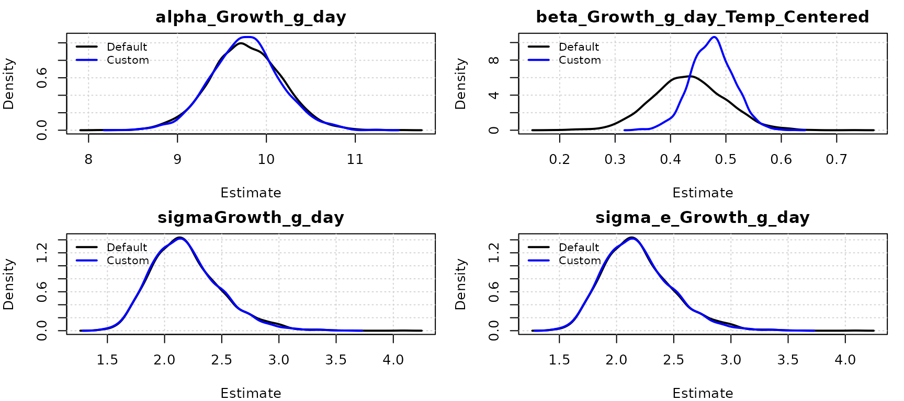
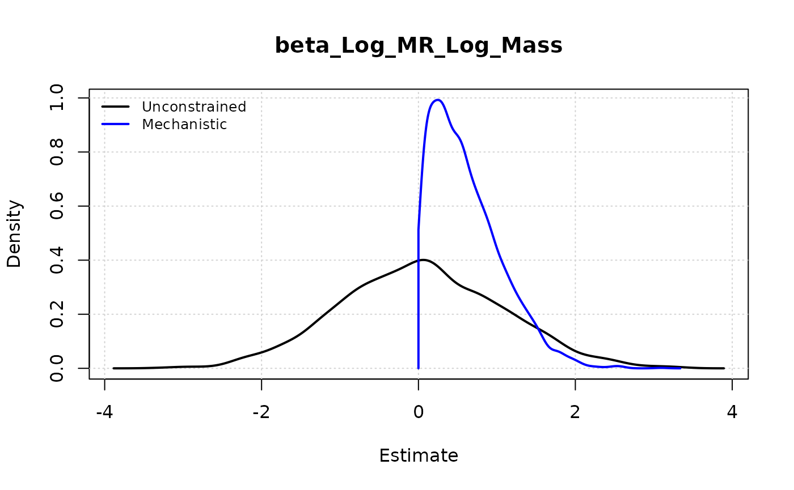
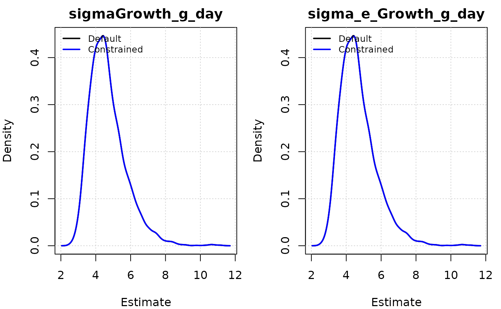

# Custom Priors and Mechanistic Constraints

## Introduction

One of the strengths of Bayesian modeling is the ability to incorporate
prior knowledge into your analysis. In the `because` package, we
generally use “uninformative” or weakly informative priors by default to
let the data speak for itself. However, there are many cases where you
might want to inject specific information:

1.  **Mechanistic Knowledge**: You know a parameter (like a growth rate)
    must be positive or lies within a biologically feasible range.
2.  **Previous Studies**: You have estimates from a previous
    meta-analysis or experiment that you want to use as a starting
    point.
3.  **Measurement Error**: You know the measurement error of an
    instrument and want to fix or constrain the residual variance.

This vignette demonstrates how to use the `priors` argument in
[`because()`](https://because-pkg.github.io/because/reference/because.md)
to override default priors and inject your own mechanistic constraints.

## Example 1: Comparing Default and Custom Priors

For this example, let’s simulate **Absolute Growth Rate** in **grams per
day (g/day)** for hypothetical juvenile birds responding to ambient
temperature.

``` r
library(because)

set.seed(42)
N <- 30
# Ambient temperature in Celsius (Mean 20C)
Temp_Raw <- rnorm(N, mean = 20, sd = 5)

# Center it so '0' represents the mean (20C).
# This ensures the intercept represents growth at average conditions,
# rather than at 0°C (where the bird would be frozen solid!).
Temp_Centered <- Temp_Raw - 20

# True relationship:
# Baseline growth at mean temp is 10 g/day.
# Every degree of warming above mean adds 0.5 g/day.
Growth_g_day <- 0.5 * Temp_Centered + 10 + rnorm(N, sd = 2)

df <- data.frame(Temp_Centered, Growth_g_day)
```

### Default Model

Let’s fit a standard model first. By default, `because` assigns wide
Gaussian priors (`dnorm(0, 1.0E-6)`) to intercepts (`alpha`) and slopes
(`beta`), and Gamma priors (`dgamma(1, 1)`) to precisions (`tau`).

``` r
fit_default <- because(
    equations = list(Growth_g_day ~ Temp_Centered),
    data = df
)
#> Converted data.frame to list with 2 variables: Growth_g_day, Temp_Centered
#> Compiling model graph
#>    Resolving undeclared variables
#>    Allocating nodes
#> Graph information:
#>    Observed stochastic nodes: 30
#>    Unobserved stochastic nodes: 3
#>    Total graph size: 159
#> 
#> Initializing model

summary(fit_default)
#>                                  Mean    SD Naive SE Time-series SE  2.5%   50%
#> alpha_Growth_g_day              9.770 0.387    0.007          0.007 9.008 9.772
#> beta_Growth_g_day_Temp_Centered 0.432 0.062    0.001          0.001 0.312 0.430
#> sigmaGrowth_g_day               2.083 0.275    0.005          0.005 1.628 2.060
#>                                  97.5%  Rhat n.eff
#> alpha_Growth_g_day              10.518 1.001  3165
#> beta_Growth_g_day_Temp_Centered  0.550 1.000  3000
#> sigmaGrowth_g_day                2.703 1.000  3000
#> 
#> DIC:
#> Mean deviance:  130.4 
#> penalty 3.165 
#> Penalized deviance: 133.6
```

### Custom Prior Model

Now, suppose we have strong prior knowledge from scaling theory or
previous literature: 1. **Intercept (Alpha)**: At **mean temperatures**
(20°C), metabolic constraints suggest growth should be around **10
g/day**. 2. **Slope (Beta)**: We expect a positive effect of
temperature, likely around **0.5 g/day/°C**.

The parameter names usually follow this convention:

**Intercepts**: `alphaResponseVariable` (e.g., `alphaGrowth_g_day`)

**Slopes**: `beta_Response_Predictor` (e.g.,
`beta_Growth_g_day_Temp_Centered`)

**Residual precision:** `tau_e_Response`

``` r
# Define our custom priors
my_priors <- list(
    # Strong prior on intercept: Mean 10, Precision 100 (SD = 0.1)
    alphaGrowth_g_day = "dnorm(10, 100)",

    # Informative prior on slope: Mean 0.5, Precision 400 (SD = 0.05)
    beta_Growth_g_day_Temp_Centered = "dnorm(0.5, 400)"
)

fit_custom <- because(
    equations = list(Growth_g_day ~ Temp_Centered),
    data = df,
    priors = my_priors
)
#> Converted data.frame to list with 2 variables: Growth_g_day, Temp_Centered
#> Compiling model graph
#>    Resolving undeclared variables
#>    Allocating nodes
#> Graph information:
#>    Observed stochastic nodes: 30
#>    Unobserved stochastic nodes: 3
#>    Total graph size: 161
#> 
#> Initializing model

summary(fit_custom)
#>                                  Mean    SD Naive SE Time-series SE  2.5%   50%
#> alpha_Growth_g_day              9.756 0.386    0.007          0.007 8.992 9.760
#> beta_Growth_g_day_Temp_Centered 0.472 0.039    0.001          0.001 0.398 0.471
#> sigmaGrowth_g_day               2.077 0.272    0.005          0.005 1.629 2.051
#>                                  97.5%  Rhat n.eff
#> alpha_Growth_g_day              10.500 1.001  3168
#> beta_Growth_g_day_Temp_Centered  0.546 1.000  3000
#> sigmaGrowth_g_day                2.696 1.000  3000
#> 
#> DIC:
#> Mean deviance:  130.2 
#> penalty 2.521 
#> Penalized deviance: 132.7
```

Notice how the credible intervals for the custom model will be tighter
and centered closer to our priors, especially if the data were sparse
(small N).

### Visualizing the Impact

We can plot the posterior estimates together to see the “shrinkage”
effect of our informative priors.

``` r
# We can use the helper function plot_posterior() to compare models.
# By passing a list of models, they are overlaid on the same plot.
# The 'parameter' argument uses partial matching (regex), so "Growth_g_day"
# will match both the intercept (alphaGrowth_g_day) and the slope (beta_Growth_g_day...).

plot_posterior(
    model = list("Default" = fit_default, "Custom" = fit_custom),
    parameter = "Growth_g_day"
)
```



## Example 2: Mechanistic Constraints

In many biological contexts, a negative effect is not just unlikely, it
is **physically impossible**.

For example, consider the relationship between **Body Mass** and
**Metabolic Rate** (Kleiber’s Law). A larger animal simply cannot
consume *less* energy than a smaller one (a negative slope), all else
equal. The physics of life requires costs to scale positively with mass.

However, if our sample size is small and measurement error is huge, we
might accidentally estimate a negative slope. We can prevent this by
enforcing a positive prior.

``` r
# Simulate data following Kleiber's Law: MR = a * Mass^0.75
# Taking logs: log(MR) = log(a) + 0.75 * log(Mass)
set.seed(42)
Mass <- runif(30, 10, 100)
# True scaling exponent is 0.75
# We add enough noise that the estimated slope might be negative by chance
Log_Mass <- log(Mass)
Log_MR <- 1.5 + 0.75 * Log_Mass + rnorm(30, sd = 2.5)

df_kleiber <- data.frame(Log_Mass, Log_MR)

# Prior: The scaling exponent (slope) must be positive
# Physics dictates that metabolic cost increases with mass.
positive_prior <- list(
    beta_Log_MR_Log_Mass = "dnorm(0, 1) T(0, )"
)

# 1. Fit Default Model (Unconstrained) - Log-Log regression
fit_default_kleiber <- because(
    equations = list(Log_MR ~ Log_Mass),
    data = df_kleiber
)
#> Converted data.frame to list with 2 variables: Log_MR, Log_Mass
#> Compiling model graph
#>    Resolving undeclared variables
#>    Allocating nodes
#> Graph information:
#>    Observed stochastic nodes: 30
#>    Unobserved stochastic nodes: 3
#>    Total graph size: 159
#> 
#> Initializing model

# 2. Fit Mechanistic Model (Constrained)
fit_mech_kleiber <- because(
    equations = list(Log_MR ~ Log_Mass),
    data = df_kleiber,
    priors = positive_prior
)
#> Converted data.frame to list with 2 variables: Log_MR, Log_Mass
#> Compiling model graph
#>    Resolving undeclared variables
#>    Allocating nodes
#> Graph information:
#>    Observed stochastic nodes: 30
#>    Unobserved stochastic nodes: 3
#>    Total graph size: 159
#> 
#> Initializing model

# Compare Estimates
summary(fit_default_kleiber)
#>                       Mean    SD Naive SE Time-series SE   2.5%   50%  97.5%
#> alpha_Log_MR         3.240 4.189    0.076          0.264 -5.155 3.253 11.523
#> beta_Log_MR_Log_Mass 0.111 1.023    0.019          0.066 -1.947 0.097  2.171
#> sigmaLog_MR          2.927 0.384    0.007          0.007  2.288 2.895  3.808
#>                       Rhat n.eff
#> alpha_Log_MR         1.004   259
#> beta_Log_MR_Log_Mass 1.004   250
#> sigmaLog_MR          1.000  2895
#> 
#> DIC:
#> Mean deviance:  151.3 
#> penalty 3.266 
#> Penalized deviance: 154.5
summary(fit_mech_kleiber)
#>                       Mean    SD Naive SE Time-series SE   2.5%   50% 97.5%
#> alpha_Log_MR         1.282 1.923    0.035          0.064 -3.394 1.646 4.018
#> beta_Log_MR_Log_Mass 0.595 0.453    0.008          0.015  0.024 0.494 1.703
#> sigmaLog_MR          2.909 0.383    0.007          0.007  2.294 2.883 3.781
#>                       Rhat n.eff
#> alpha_Log_MR         1.001   969
#> beta_Log_MR_Log_Mass 1.001  1003
#> sigmaLog_MR          1.000  3165
#> 
#> DIC:
#> Mean deviance:  150.6 
#> penalty 2.305 
#> Penalized deviance: 152.9

# Visualize: Unconstrained vs. Truncated
plot_posterior(
    list(Unconstrained = fit_default_kleiber, Mechanistic = fit_mech_kleiber),
    parameter = "beta_Log_MR_Log_Mass",
    density_args = list(Mechanistic = list(from = 0))
)
```



## Example 3: Informing Residual Variance components

We usually estimate the residual variance (`sigma` or its inverse `tau`)
from the data. However, you might have prior knowledge about the
expected noise level.

> \[!NOTE\] **Distinction from `variability` argument**: The
> `variability` argument in
> [`because()`](https://because-pkg.github.io/because/reference/because.md)
> is designed for **Measurement Error** in predictors
> (Error-in-Variables) or when you have repeated measures per
> individual.
>
> Custom priors on `tau_e`, shown below, are for providing information
> about the **Residual Variance** of the response variable (which
> includes both Process Error and unrecognized Observation Error).

For example, if you know the precision of your scale is roughly 2 g,
this gives you a strong expectation for the residual standard deviation
(sigma).

``` r
# Simulate small, noisy dataset
set.seed(42)
N_small <- 15
Temp_Small <- rnorm(N_small, 20, 5)
# Actual residual SD = 3 (quite noisy)
Growth_Small <- 0.5 * Temp_Small + rnorm(N_small, sd = 3)
df_small <- data.frame(Growth_g_day = Growth_Small, Temp_Centered = Temp_Small - 20)

# 1. Default Model (Weak Prior)
# The data (SD=3) will dominate, finding a sigma around 3 with wide uncertainty.
fit_default_var <- because(
    equations = list(Growth_g_day ~ Temp_Centered),
    data = df_small,
    quiet = TRUE
)

# 2. Constrained Model (Strong Prior)
# Suppose we have theoretical reasons to believe residual SD should be small (~1.0).
# Precision = 1/1^2 = 1.
# dgamma(20, 20) -> Mean 1, Variance 0.05 (Strong)
variance_prior <- list(
    tau_e_Growth_g_day = "dgamma(20, 20)"
)

fit_constrained_var <- because(
    equations = list(Growth_g_day ~ Temp_Centered),
    data = df_small,
    priors = variance_prior,
    quiet = TRUE
)

# Visualize: The constrained posterior will be shifted left (towards 1) and sharper
plot_posterior(
    list(Default = fit_default_var, Constrained = fit_constrained_var),
    parameter = "sigma"
)
```



## Default Priors Reference

It is important to know what you are overriding. `because` aims to use
**weakly informative** defaults that provide minimal regularization
while allowing the data to dominate the posterior.

| Parameter Type        | Parameter Name | Default Prior        | Description                                                       |
|:----------------------|:---------------|:---------------------|:------------------------------------------------------------------|
| **Intercepts**        | `alpha_*`      | `dnorm(0, 1.0E-6)`   | Wide Normal (Precision 1e-6 = Variance 1,000,000)                 |
| **Coefficients**      | `beta_*`       | `dnorm(0, 1.0E-6)`   | Wide Normal                                                       |
| **Precision**         | `tau_*`        | `dgamma(1, 1)`       | Gamma(1,1). Weakly informative for precision/variance components. |
| **Phylo Signal**      | `lambda_*`     | `dunif(0, 1)`        | Uniform on \[0,1\]                                                |
| **Zero-Inflation**    | `psi_*`        | `dbeta(1, 1)`        | Beta(1,1) (Uniform on \[0,1\])                                    |
| **Ordinal Cutpoints** | `cutpoint_*`   | `dnorm(0, 1e-6)`     | First cutpoint fixed, others relative or specifically ordered     |
| **NegBinomial Size**  | `r_*`          | `dgamma(0.01, 0.01)` | Wide Gamma for dispersion parameter                               |

> **Precision vs Variance**: JAGS uses precision $\tau = 1/\sigma^{2}$.
> A prior of `dnorm(0, 1.0E-6)` means a normal distribution with mean 0
> and precision $0.000001$, which corresponds to a variance of
> $1,000,000$ (SD = 1000). This is very flat.

## Parameter Names Reference

To use custom priors, you need to know the exact internal name of the
parameter in the JAGS code.

Common patterns:

- `alpha_{Response}`: Intercept
- `beta_{Response}_{Predictor}`: Regression coefficient
- `tau_e_{Response}`: Residual precision
- `sigma_{Response}`: Residual standard deviation (derived, usually not
  set directly as prior, set `tau` instead)
- `lambda_{Response}`: Phylogenetic signal (0-1)
- `psi_{Response}`: Zero-inflation probability

If you are unsure, run a quick model with `n.adapt=0, n.iter=0` (just
compilation) and check the generated model code:

``` r
fit_check <- because(
    equations = list(Growth_g_day ~ Temp_Centered),
    data = df,
    n.iter = 0, quiet = TRUE
)

# Print the JAGS model
fit_check$model
#> [1] "model {\n  # Common structures and priors\n  # Structural equations\n\n  for (i in 1:N) {\n    mu_Growth_g_day[i] <- alpha_Growth_g_day + beta_Growth_g_day_Temp_Centered*Temp_Centered[i]\n  }\n  # Multivariate normal likelihoods\n  for (i in 1:N) {\n    Growth_g_day[i] ~ dnorm(mu_Growth_g_day[i], tau_e_Growth_g_day)\n    log_lik_Growth_g_day[i] <- logdensity.norm(Growth_g_day[i], mu_Growth_g_day[i], tau_e_Growth_g_day)\n  }\n  # Priors for structural parameters\n  alpha_Growth_g_day ~ dnorm(0, 1.0E-6)\n  tau_e_Growth_g_day ~ dgamma(1, 1)\n  sigmaGrowth_g_day <- 1/sqrt(tau_e_Growth_g_day)\n  beta_Growth_g_day_Temp_Centered ~ dnorm(0, 1.0E-6)\n}"
```

\`\`\`
