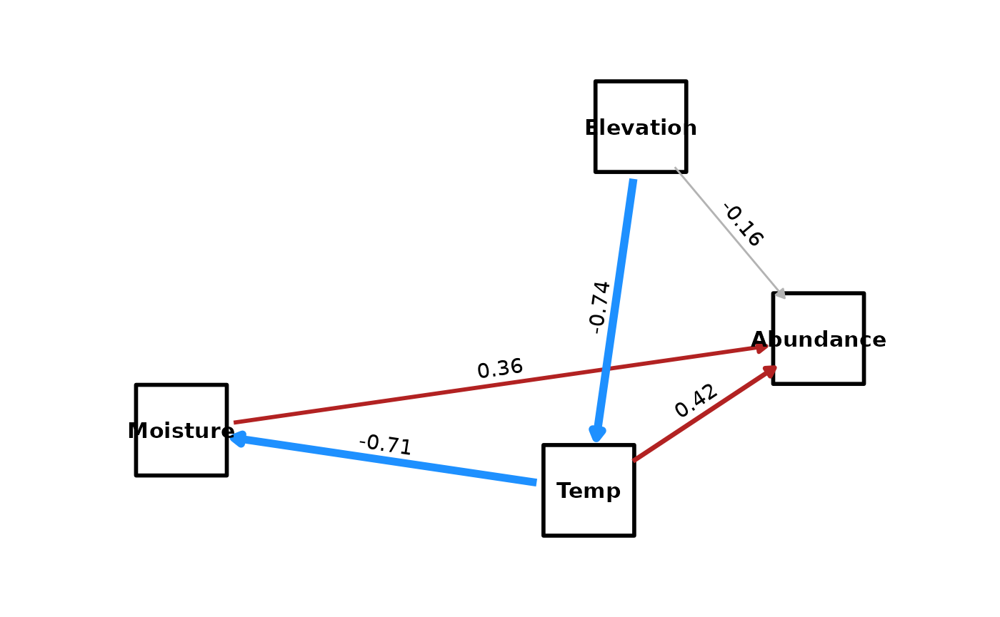

# Mediation Analysis

## Introduction

Causal inference often requires investigating *how* an effect occurs.
Does $X$ affect $Y$ directly, or does it work through a mediator $M$?

The `because` package provides a fully automated Bayesian mediation
analysis tool,
[`because_mediation()`](https://because-pkg.github.io/because/reference/because_mediation.md),
which decomposes the Total Effect of an exposure on an outcome into: 1.
**Direct Effect**: The effect of $\left. X\rightarrow Y \right.$ not
mediated by other variables in the graph. 2. **Indirect Effect(s)**: The
effect propagated through intermediate variables
($\left. X\rightarrow M\rightarrow Y \right.$).

This is calculated by multiplying the posterior distributions of
coefficients along each path, preserving full uncertainty
quantification.

## Example: Ecological Mediation (Elevation Gradient)

In this example, we investigate how **Elevation** affects **Plant
Abundance**. We hypothesize that Elevation acts through a causal chain
involving Temperature and Soil Moisture:

1.  **Elevation** determines **Temperature** (higher elevation
    $\rightarrow$ lower temperature).
2.  **Temperature** influences **Soil Moisture** (lower temperature
    $\rightarrow$ lower evaporation $\rightarrow$ higher moisture).
3.  **Abundance** is driven by **Moisture**, **Temperature**, and
    potentially a direct effect of **Elevation** (e.g., due to UV
    radiation or partial pressure of gases).

### 1. Simulate Data

We simulate $N = 200$ plots along an elevation gradient.

``` r
library(because)

set.seed(42)
N <- 200

# 1. Elevation (Exogenous variable)
# Ranges roughly from 500m to 1500m
Elevation <- rnorm(N, mean = 1000, sd = 200)

# 2. Temperature (Mediator 1)
# Decreases with Elevation (Lapse rate approx effect)
# Coef: -0.01 implies 100m climb -> -1 degree C
Temp <- 25 - 0.01 * Elevation + rnorm(N, sd = 2)

# 3. Moisture (Mediator 2)
# Driven by Temperature. Cooler -> Moister.
# We model a negative relationship with Temp.
Moisture <- 20 - 2 * Temp + rnorm(N, sd = 5)

# 4. Plant Abundance (Outcome)
# - Positive effect of Moisture (+0.5)
# - Positive effect of Temperature (+1.5)
# - Direct negative effect of Elevation (-0.005) due to harsh conditions
Abundance <- 10 + 0.5 * Moisture + 1.5 * Temp - 0.005 * Elevation + rnorm(N, sd = 10)

eco_data <- data.frame(Elevation, Temp, Moisture, Abundance)
head(eco_data)
#>   Elevation      Temp   Moisture Abundance
#> 1 1274.1917  8.256225  10.162114  18.60961
#> 2  887.0604 16.796951 -17.940260  26.01320
#> 3 1072.6257 16.616393 -12.955352  32.96032
#> 4 1126.5725 17.853353 -15.461372  31.77216
#> 5 1080.8537 11.437740  -5.767259  12.26349
#> 6  978.7751 12.910538 -10.814769  34.70524
```

### 2. Standardize Data

**Important:** For mediation analysis, it is highly recommended to
**standardize** your continuous variables (mean = 0, sd = 1) before
fitting.

Standardization ensures that: 1. **Coefficients are comparable**: All
effects are expressed in standard deviation units (standardized
effects). 2. **Scale Invariance**: The calculation of Indirect Effects
(product of coefficients) is more interpretable relative to the Total
Effect. 3. **Convergence**: MCMC sampling often behaves better with
standardized scales.

``` r
# Standardize all variables
eco_data_std <- scale(eco_data)
head(eco_data_std)
#>        Elevation       Temp    Moisture  Abundance
#> [1,]  1.43491089 -2.4146372  2.79684187 -0.2519564
#> [2,] -0.55122296  0.6086453 -1.01750576  0.4847317
#> [3,]  0.40079909  0.5447309 -0.34090197  1.1759989
#> [4,]  0.67756730  0.9825952 -0.68104515  1.0577725
#> [5,]  0.44301183 -1.2884308  0.63474109 -0.8834208
#> [6,] -0.08069081 -0.7670836 -0.05035969  1.3496260
```

### 3. Fit the Structural Equation Model

We define the structural equations reflecting our causal DAG. Notice the
chain: `Elevation -> Temp -> Moisture -> Abundance`.

``` r
# Define the structural equations
eco_eqs <- list(
  Temp ~ Elevation,
  Moisture ~ Temp,
  Abundance ~ Moisture + Temp + Elevation
)

# Fit the model
# We use a short chain for demonstration purposes. Use more iterations for real analysis.
fit <- because(
  equations = eco_eqs,
  data = eco_data_std,
  n.iter = 2000
)
#> Converted data.frame to list with 4 variables: Temp, Elevation, Moisture, Abundance
#> Compiling model graph
#>    Resolving undeclared variables
#>    Allocating nodes
#> Graph information:
#>    Observed stochastic nodes: 600
#>    Unobserved stochastic nodes: 11
#>    Total graph size: 3028
#> 
#> Initializing model
summary(fit)
#>                            Mean    SD Naive SE Time-series SE   2.5%    50%
#> alpha_Abundance          -0.002 0.064    0.003          0.003 -0.129 -0.004
#> alpha_Moisture           -0.005 0.051    0.002          0.002 -0.106 -0.006
#> alpha_Temp               -0.001 0.048    0.002          0.002 -0.092 -0.002
#> beta_Abundance_Elevation -0.156 0.095    0.004          0.004 -0.352 -0.160
#> beta_Abundance_Moisture   0.358 0.090    0.004          0.004  0.189  0.359
#> beta_Abundance_Temp       0.416 0.115    0.005          0.005  0.201  0.415
#> beta_Moisture_Temp       -0.710 0.051    0.002          0.002 -0.813 -0.709
#> beta_Temp_Elevation      -0.741 0.048    0.002          0.002 -0.828 -0.742
#> sigmaAbundance            0.934 0.049    0.002          0.002  0.843  0.932
#> sigmaMoisture             0.711 0.037    0.002          0.002  0.645  0.709
#> sigmaTemp                 0.674 0.034    0.002          0.002  0.610  0.672
#> sigma_e_Abundance         0.934 0.049    0.002          0.002  0.843  0.932
#> sigma_e_Moisture          0.711 0.037    0.002          0.002  0.645  0.709
#> sigma_e_Temp              0.674 0.034    0.002          0.002  0.610  0.672
#>                           97.5%  Rhat n.eff
#> alpha_Abundance           0.125 1.004   583
#> alpha_Moisture            0.099 0.999   434
#> alpha_Temp                0.091 1.002   499
#> beta_Abundance_Elevation  0.032 1.000   487
#> beta_Abundance_Moisture   0.530 0.999   508
#> beta_Abundance_Temp       0.642 1.003   565
#> beta_Moisture_Temp       -0.615 0.999   465
#> beta_Temp_Elevation      -0.647 1.001   480
#> sigmaAbundance            1.030 0.998   480
#> sigmaMoisture             0.780 1.001   480
#> sigmaTemp                 0.746 1.005   480
#> sigma_e_Abundance         1.030 0.998   480
#> sigma_e_Moisture          0.780 1.001   480
#> sigma_e_Temp              0.746 1.005   480
#> 
#> DIC:
#> Mean deviance:  1377 
#> penalty 11.23 
#> Penalized deviance: 1389
```

We can also plot the fitted causal model with its standardised paths:

``` r
plot_dag(fit)
```



### 4. Perform Mediation Analysis

We want to understand the Total Effect of **Elevation** on
**Abundance**, and decompose it into its direct and indirect components.

``` r
# Run Mediation Analysis for Elevation -> Abundance
med_results <- because_mediation(fit, exposure = "Elevation", outcome = "Abundance")
```

#### Inspect the Summary

``` r
med_results$summary
#>                    Type       Mean         SD      Lower       Upper
#> 1          Total Effect -0.2757059 0.06687637 -0.4093048 -0.15266327
#> 2         Direct Effect -0.1563994 0.09541511 -0.3515907  0.03157144
#> 3 Total Indirect Effect -0.1193065 0.07344900 -0.2604293  0.02290439
```

**Interpretation (Standardized Units):** \* **Total Effect**: The net
impact of Elevation on Abundance in SD units. \* **Direct Effect**: The
path `Elevation -> Abundance` (independent of mediators). \* **Total
Indirect Effect**: The sum of all mediated paths. In our simulation,
Elevation lowers Temp, which raises Moisture, which increases Abundance.

#### Inspect Individual Paths

The `because_mediation` function automatically traces all valid paths
from exposure to outcome in the DAG.

``` r
med_results$paths
#>                                         Path     Type       Mean         SD
#> 1 Elevation -> Temp -> Moisture -> Abundance Indirect  0.1887720 0.05302702
#> 2             Elevation -> Temp -> Abundance Indirect -0.3080785 0.08725969
#> 3                     Elevation -> Abundance   Direct -0.1563994 0.09541511
#>         Lower       Upper
#> 1  0.09457531  0.29462758
#> 2 -0.48333762 -0.14229962
#> 3 -0.35159070  0.03157144
```

We expect to see three distinct paths:

1.  **Direct**: `Elevation -> Abundance`
2.  **Short Indirect**: `Elevation -> Temp -> Abundance`
    - Elevation lowers Temp (negative correlation); Temp increases
      Abundance (positive correlation).
    - The product of these effects is **Negative**.
3.  **Long Indirect (Chain)**:
    `Elevation -> Temp -> Moisture -> Abundance`
    - Elevation lowers Temp (negative).
    - Lower Temp raises Moisture (negative relationship $\rightarrow$
      positive change in moisture).
    - Higher Moisture raises Abundance (positive).
    - The chain involves two negative links and one positive link,
      resulting in a **Positive** indirect effect.

The function handles this decomposition automatically, providing
credibility intervals for each specific mechanism.

### Technical Note

The function calculates the indirect effect as the product of
coefficients along the path. For example, for the long chain:
$$\text{Indirect}_{\text{chain}} = \beta_{Elev\rightarrow Temp} \times \beta_{Temp\rightarrow Moist} \times \beta_{Moist\rightarrow Abund}$$
This approach is standard for linear models. For non-linear models, this
represents an approximation of the average causal effect.
